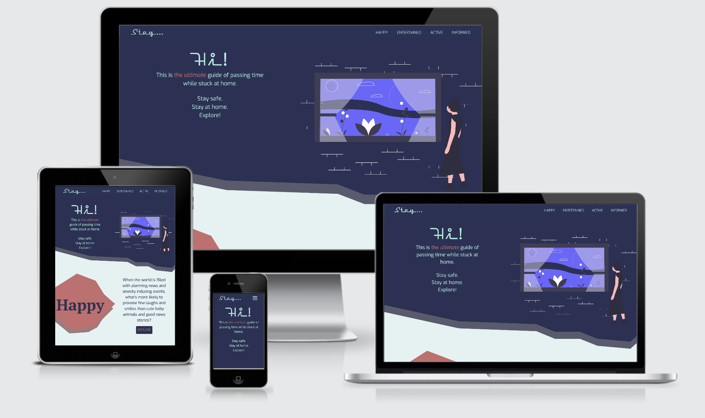
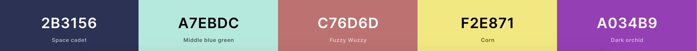
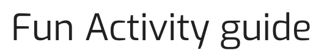
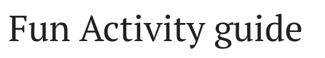

<h1 align="center">Fun Activity Guide</h1>
<h1 align="center"></h1>

  :point_left: Live website

   :point_left: GitHub Repository
 
 ## About

This website was created to bring fun and joy to anyone who has found themselves in a 'quarantine' type of situation. It is a guide of different types and ways of entertainment to keep ourselves busy while the world is going through a crisis. Not only is it useable and responsive on all devices but it's looking good while doing so.
 

## Table of Contents

[User Experience (UX)](#UX)

[Features](#features)

[Technologies Used](#technologies)

[Testing](#testing)

[Deployment](#deployment)

[Known Bugs](#bugs)

[Credits](#credits)

## User Experience (UX)

### User Stories
- #### As a visitor for who staying at home for a longer period is a new thing (such as people not working at the moment and are in quarantine).
    1. I want to easily understand the purpose and the layout of the site without additional instructions needed.
    1. I want to intuitively navigate through the site to browse the content.
    1. I want to enjoy the design and for it to add to the overall feel of entertainment.
    1. I want to access external links and be able to learn more about each activity mentioned.
    1. I want to find a variety of entertainment sources to match up with my interests.
    1. I want to be able to click and interact with the page rather than scroll to build on the feeling of fun.
- #### A visitor who is looking for new types of entertainment, such as someone who has been in quarantine for a while and has exhausted all sources of entertainment known to her/him.
    1. I want to explore unique ideas of entertainment to find more ways to pass time.
    1. I want to feel like the creator understands what they are talking about and their suggestions are worthy of my time.
    1. I want to be able to scan through the content quickly and find concise information before I commit to any specific topic.
- #### As a visitor who has already visited this website and is using it as a reference.
    1. I want to be able to use the website on any device so I can keep it handy.
    1. I want to use the navigation at all times and have it readily available so I can quickly navigate from one page to another.
    1. I want to provide my feedback so that the site can be improved and has all my favorites.
- #### As a visitor looking to stay entertained and active at home.
    1. I want to find a variety of different physical activities.
    1. I want to be able to access the activities mentioned without having to look for them myself.
    1. I want to find activities that are various difficulty levels to be able to use them no matter how I feel or what my fitness level is.

### Design

- #### Colour scheme
    - As the main goal of this website is to provide entertainment ideas, the colors used had to tie in with that mentality.  
    The page is quite colorful to grab attention and invoke the sense of fun while keeping most colors quite low in saturation 
    (more muted rather than punchy, bright colors). The main color trio was picked using a split [complimentary approach](http://www.paletton.com/wiki/index.php?title=Split_complementary_color_scheme) of the color theory and manually customising it to fit the needs of the website. The colors chosen are 
    space cadet (#2B3156), middle blue green (#A7EBDC), and Fuzzy Wuzzy (muted orangey red) (#C76D6D). 
    Where suitable, monochromatic, complementary colors were used, however, some pages required brighter color accents, in which case, secondary colors used were Corn (#F2E871) and Dark Orchid (#A034B9).

        

- #### Typography
    - The main font used is a sans-serif type of font 'Exo' with sans-serif as a fallback font. This font is easy to read as it's not decorated and is quite wide to provide an easy-going feeling opposed to some serif fonts.

        

    - The secondary font used for titles is 'PT Serif' with serif as a fallback, which creates a feeling of importance and legitimacy.

        

    - The font used for accents is 'neon-stream' with sans-serif as a fallback. I chose this font to go with the muted-retro colors and create a retro arcade feel to the page.

        
        

- #### Imagery
    -(Images on this website serve two purposes. The first is to emphasize and illustrate a certain activity. And the second is to create a fun environment for a visitor to enjoy) have an important part to play in how we consume information and how we understand it so naturally, it's an important part in my website. I used a combination of graphics and pictures to emphasize the meaning and type of activity described. The pictures were created with a single color overlay to tie in with the color scheme and not look too distracting.

 
## Features

### Existing Features

- ### Common
    - #### Header - allows user to easily navigate accross all pages
        - Header itself is positioned to always be visible (positionet absolutely using Bootstrap 'sticky-top' class) at the top of the screen (mobile and desktop) which allows visitors to find it quickly.
        - The brand logo is positioned on the left and is visible on all pages, it serves as a home page link so the user can find her/his way back if needed.
        - Navigation is included in the header to let the user intuitively locate it.
        - Navigation links increase in size and are underlined (only in desktop) when hovered over. This lets the visitor know that it is clickable.
        - The navigation link, matching the page that the user is visiting, stays 'active' to let user quickly establish which page she/he is visiting.
        - Navigation links collapse in a personalised hamburger menu when viewed in mobile sizes.
        - Colors have been chosen with optimum contrast in mind to be pleasent to the eye.
    - #### Links that are hovered over
        - All links that are surrounding text have been underlined and change color when hovered over. This helps the user to identify external links.
        - All picture links have been called out in a paragraph above them. This informs the user that there is more information if they wish to learn more. This also helps users who are using screen readers by letting them know what to look for in advance.
    - #### Top Page Banners
        - Banners for all pages have been styled in the same manner which gives the user a feeling of cohesion and familiarity.
        - The image is fixed so that the content bellow scrolls over it. This creates a modern feeling and gives user a feeling of control as they are the ones 'moving' the content.
        - The Banner text is responsive depending on the viewport width to avoid overspilling.
    - #### Accessibility
        - All Pages have a descritpion in case the image link breaks as well as helps screen readers.
        - Hamburger menu has aria label added to let users with screen readers know where the toggleable menu is.
        - (WAI ARIA used whenever appropriate as an indication to the screen readers when something is or is not accessible)
    - #### Buttons
        - All buttons are styled in the same way to provide the consistancy across the page.Moreover, an inverted color scheme is applied to a button whenever hovered over.
    - #### Decorative elements
        - Custom created decorative styling backgrounds are used accross all pages provifing user with a consistent and unique webpage browsing experience.
    - #### Responsivness
        - All Pages are responsive and provide the same functionality regardless of the viewport size.
    - #### Footer
        - Footer has been designed to be at the bottom of the page, regardless of the amoount of content. This aids the overall user experience.
        - All content has been spaced out but aligned to the right to mirror the navigation links in the header creating an intuitive position.
        - Social links have been grouped together to signify their connection, when hovered over, they increase in size.
        - 'About' link is a collapsable bootstrap element which, when clicked, expands and reveals a short descritpion of the page without leaving the page.
        - 'Contact' link is also a collapsable bootstrap element containing a form. This form is meant for any feedback or suggestions a user might have. This lets's the user participate in the creation/improvement of the page.

- ### Specific to Pages
    - #### Landing Page
        - Custom background created to set the mood of the website. This serves as a hero image with a call-to-action button that leads to the homepage. The image takes up the whole viewport to bring the users attention to the heading and inviting the user to explore the website.
    - #### Home
        - A short introduction of the page to let user know what the purpose of the page is.
        - Short descriptions of each page with a call-to-action buttons attached. This lets the user learn more about each page, and visit the relevant site.
    - #### Happy
        - Image carousel that is responsive and changes dimensions depending on the viewport size. This lets the mobile users view images in portrait layout while desktop users can enjoy them in landscape mode. This provides a more enjoybale experience and leaves a bigger impact.
        - Card elements used to display individual good news stories. Each image in the card is clickable and lets the user visit relevant sites to read more about the subject.
    - #### Entertained
        - Short description of each entertainment item, with clickable image that leads the user to a webpage to learn more about said item.
    - #### Informed
        - Important alert message about safety during the coronavirus that includes links to the official government sites. This keeps the user aware of safety concerns and provides a trusted source of the latest information.
        - The most important safety principles are highlighted in boxes to attract users attention.
        - Card elements used to group multiple sources of information depending on the way the information will be consumed (documentaries, short videos or audio), this gives the user a choice in how they can stay informed without the need of reading.

### Future Features
 
- Ongoing implimentation of user feedback
- Create a way for the user to rate the website without having to type up feedback
- A page where people can leave their positive experiences during the pandemic or just share positive content wth others
- Adding a way for people to 'like' (provide someone with positive feedback) the content that has been shared by others

## Technologies Used

### Languages Used

- [HTML5](https://en.wikipedia.org/wiki/HTML5)
- [CSS3](https://en.wikipedia.org/wiki/Cascading_Style_Sheets)
- [JavaScript](https://www.javascript.com/)

### Frameworks, Libraries and Programs Used

- [Bootstrap v4.5.0](https://getbootstrap.com/) - Used for the responsove layout as well as custom components such as image carousel, navigation bar, footer, cards and collapse element.
- [jquery](https://jquery.com/) - Used in some of the clickable elements such as collapsable 'hamburger' nav bar and collapse element.
- [popper.js](https://popper.js.org/) - Used in some of the clickable elements such as collapsable 'hamburger' nav bar and collapse element.
- [Font Awesome](https://fontawesome.com/) - Font Awesome was used to add social icons and complement the design.
- [Google Fonts](https://fonts.google.com/) - Google Fonts was used to import 'Exo' and 'PT Sarif' fonts in the main.css stylesheet.
- [Adobe Fonts](https://fonts.adobe.com/) - Adobe Fonts was used to import 'NeonStream' font which was the accent font in this project and cannot be found on Google Fonts website.
- [Git](https://git-scm.com/) - Git was used to allow for tracking of any changes in the code and for the version control.
- [GitPod](https://www.gitpod.io/) - GitPod, conected to GitHub, hosted the coding space and allowed the projected to be commited to the Github repository.
- [Github](https://github.com/) - GitHub is used to host the project files and publish the live website by using Git Pages.
- [Lightroom](https://www.adobe.com/ie/products/photoshop-lightroom.html?gclid=CjwKCAjwwYP2BRBGEiwAkoBpAqomS77OrQwQggC9QPnPACrkLBs-2AcrW9ZUvxbUJnFOgbRGKNeNEhoC95IQAvD_BwE&sdid=88X75SKS&mv=search&ef_id=CjwKCAjwwYP2BRBGEiwAkoBpAqomS77OrQwQggC9QPnPACrkLBs-2AcrW9ZUvxbUJnFOgbRGKNeNEhoC95IQAvD_BwE:G:s&s_kwcid=AL!3085!3!394412108599!e!!g!!lightroom) - Lightroom was used to edit and resize all images.
- [Photoshop](https://www.adobe.com/ie/products/photoshop.html?gclid=CjwKCAjwwYP2BRBGEiwAkoBpAuYIg7JHUAFtnRQB28LDaU5gvFxhLX_56PYV2xbl6bTKvYSjK5yoLhoCkjQQAvD_BwE&sdid=88X75SKS&mv=search&ef_id=CjwKCAjwwYP2BRBGEiwAkoBpAuYIg7JHUAFtnRQB28LDaU5gvFxhLX_56PYV2xbl6bTKvYSjK5yoLhoCkjQQAvD_BwE:G:s&s_kwcid=AL!3085!3!340674288378!e!!g!!photoshop) - Photoshop was used to create the background graphic for the Landing page as well as the favicon.
- [Adobe Xd](https://www.adobe.com/ie/products/xd.html) - Adobe Xd was used to create wireframes and mockups.
    - [UnDraw](https://xd.undraw.co/) - UnDraw plugin was used to obtain royalty free graphics used in the 'Home' and 'Active' pages.
    - [ToolKit](https://manoharmanu.online/toolkit_plugin) - ToolKit plugin was used to obtain Royalty free images from UnSplash.
    - [Icons 4 Design](http://emsoftware.com/xdplugins/icons-4-design/) - Icons 4 Design was used to add some icons accross the page such as the alert sign on the 'Informed' page.
- [TinyJPG](https://tinyjpg.com/) - TinyJPG was used to lower the resolution of the images.

## Testing

 1. ### Functionality Testing
    - All external links were tested to make sure they open up the correct pages in new tabs
        - All social links in the footer bring the user to the relevant social pages
        - All picture links in the Happy, Entertained and Informed pages, open the relevant website to let the user find out more information
        - All links in the Active page open a YouTube video of the clicked exercise
        - Both links in the top section of the Informed page bring the user to the correct sites
    - All internal links were tested to make sure that all pages are correclty connected 
        - Landing Page brings the user to the Home Page
        - Navigation links bring the user to the relevant pages
        - Brand word located in the navigation bar always brings the user to the home page
    - The Form functions correclty
        - Email validation is working properly, requiring a valid email address to be entertained
        - Name and text fields require at least two characters of text to be entertained
        - Submit button lets you 'submit' the form only if above fields have been filled out correclty

2. ### CSS3 validator - Pass
    

        
    

3. ### HTML5 validator
    - Landing Page - Pass - [Results](https://validator.w3.org/nu/?doc=https%3A%2F%2Fliigalized.github.io%2FMS1_boredom_guide%2Findex.html)
    - Home Page - Pass - [Results](https://validator.w3.org/nu/?showsource=yes&doc=https%3A%2F%2Fliigalized.github.io%2FMS1_boredom_guide%2Fhome.html)
    - Happy Page - Pass - [Results](https://validator.w3.org/nu/?showsource=yes&doc=https%3A%2F%2Fliigalized.github.io%2FMS1_boredom_guide%2Fhappy.html)
    - Entertained Page - Pass - [Results](https://validator.w3.org/nu/?doc=https%3A%2F%2Fliigalized.github.io%2FMS1_boredom_guide%2Fentertained.html)
    - Active Page - Pass - [Results](https://validator.w3.org/nu/?doc=https%3A%2F%2Fliigalized.github.io%2FMS1_boredom_guide%2Factive.html)
    - Informed Page - Pass - [Results](https://validator.w3.org/nu/?doc=https%3A%2F%2Fliigalized.github.io%2FMS1_boredom_guide%2Finformed.html)

4. ### Usability Testing
    - To test the ease of navigation, this website was shared with few friends of different ages and different levels of computer/smart device knowledge. There were no issues identified regarding the simplicity of navigating the website.
    - The testers also verified that all buttons, links, hamburger menu and photo carousel work correctly, intuitively and as expected

5. ### Compatibility Testing
    - Desktop bowser compatibility was tested using the latest verisons on Opera, Firefox, Microsoft Edge, Chrome and Safari browsers.
    - Mobile browser compatibility was tesed using the mobile versions of Chrome, Firefox, Opera Touch and Safari iOS.
    - OS Compatibility was tested on iOS 13.4.1, Android 10.0, MacOS Catalina, iPadOS 13.4.1 and Windows 10. It is yet to be tested on Unix, Linux or Solaris Operating Systems.
    - The devices used in this testing include Macbook Pro, Toshiba laptop, iPad Pro, iPhone Xr, Xiaomi 3, HTC 11, iPhone 8 and other android mobile phones.
    - The website was exhaustively tested for responsiveness on [Chrome DevTools](https://developers.google.com/web/tools/chrome-devtools). Different viewport sizes were simulated ranging from as small as iPhone 5 (320px) to large desktop sizes (1200px and above).

6. ### Performance Testing
    - Overall WebPage Performance Test was done using [WebPageTest](https://www.webpagetest.org/) with test location set to Ireland and test browser set to Chrome. Some areas of improvement according to this website are Security of the site and Cache Ststic Content which are out of the scope of this particular project, however, I will be looking to imporve these in the future.
        - Landing Page - [Results](https://www.webpagetest.org/result/200518_SN_8b1c098849ba0d339e771cca15846296/)
        - Home Page - [Results](https://www.webpagetest.org/result/200518_18_7856b3fa7df127473d23d829d1ef3eab/)
        - Happy Page - [Results](https://www.webpagetest.org/result/200518_MK_d764a4ff6cf1db6c48b145f219dfbc27/)
        - Entertained Page - [Results](https://www.webpagetest.org/result/200518_8G_5bcc3467dde8cc9c2f134da6d3e1efcf/)
        - Active Page - [Results](https://www.webpagetest.org/result/200518_E1_9ca933f91b804f2a3993887818212cf1/)
        - Informed Page - [Results](https://www.webpagetest.org/result/200518_ER_09a540520ef76222ec401d705036334c/)

7. ### Testing User Stories 
- #### As a visitor for whom staying at home for longer period of time is a new thing (such as people not working at the moment and are in a quarantine),
    1. I want to easily understand the purpose and the layout of the site without additional instructions needed
        - The landing page is simple and clear with one word text asking if the user is bored and if so they have an option to enter the website by clicking the button underneath the text that says 'Explore'. This gives an indication that th website is created for entertainment purposes.
        - The home page has a concise description of the website and an option to scroll down the page. If the user chooses to scroll down they will find four short summaries, one for each page, to let them know what kind of content can be found.
        - When exploring different pages, user will see similar design which will make the pages feel familiar and user won't feel confused each time they click on a new page.
    2. I want to intuitively navigate through the site to browse the content
        - The first page they would 'explore' wouold be the home page which, as already mentioned, has some information about each site and an option navigate to each site by using associated call to action buttons.
        - The user also has an option to use the navigation bar which looks the same on each page and is always visible at the top of the screen.
        - In the naviagtion bar, the name of the page is larger and underlined.
        - Each individual page has a top banner with the page name highlighted to instantaniously let the user know what page they are on.
        - On each page user will find sections with clear headings and short, one sentance descriptions of what each section is about.
    3. I want to be captivated by the design to keep my atteniton.
        - The design was custom created avoiding generic templates to lure the user in and make them feel like the content is as interesting as the design and vice versa
        - The red color create the sense of excitement while the muted blue shows sophistication. Contrast between text and the background makes it easy for the user to consume the content while the contrast between each section builds on the sense of exploration.
        - While each page was designed to haev common aspects, they were also designed not to be the same. The user won't get bored by the time they open the last page.
    4. I want to access external links and be able to learn more about each activity mentioned
        - Happy Page
            - Under the section 'Good News Stories' the user will find short description of few good news stories with a large image clearly associated with it
            - Under the section heading it is indicated that the images can be clicked on to read each storie in full
            - Once the image is clicked, the relevant external webpage will open in a new tab so that user can easily navigate back to the original page
        - Entertained Page
            - The user will find seven articles describing different avenues of entertainment with a large image associated with it.
            - Under the section heading it is indicated that the images can be clicked on to learn more
            - Once the image is clicked, the relevant external webpagr will open in a new tab
        - Active Page
            - Upon entering, the user will see four types of different physical activities, each type lists three exercses.
            - All exercises have been underlined to indicate that they are clickable links.
            - Once the user clicks a link, the exercise video will open in a new tab.
        - Informed Page
            - THe first thing the user will see is a warning statement to stay safe during COVID-19 with two external links for the user to find accurate, up to date information
            - The links are underlined and will lead to WHO or HSE websites which will open in a new tab
            - The user can scroll down to the bottom section with different sources of information listed
            - Each source is a link which has been indicated by an underline and when clicked, brings the user to an external webpage in a new tab.
    5. I want to find a variety of entertainment sources to match up with my interests
        - The Happy Page has cute animal pictures and Good News Stories
        - The Entertained Page has seven different ways for the user to entertain themselves during their stay at home. These cover a wide range of interests and activity levels.
        - The Active Page provides the user with four different levels of physicial activities that can be done at home or walking outside. The user can see the difficulty, equipment and fun level of each type of exercises as well as find links to each. 
        - The Informed Page gives the user an option to find the latest offcial updates regarding the pandemic. The bottom section of this page provides alternative methods to stay informed in case the user prefers watching videos, documentaries or listen to podcasts instead of reading.
    6. I want to be able to click and interact with the page rather than scroll to build on the feeling of fun
        - The site was desgned as multiple pages rather than one screollable page which lets the user click on buttons and explore the site.
        - The Home site has buttons under each article to bring them to the relavant page.
        - All Pages have few clickable links.
        - The picture caroused on the Happy Page has buttons to navigate from one picture to another.
- #### A visitor who is looking for new types of entertainment, such as someone who has been in a quarantine for a while and has exhausted all sources of entertainment known to her/him
    1. I want to explore unique ideas of entertainment to find more ways to pass time
        - The Entertained section has been uniquely curated to include less known or overlooked methods of entertainment such as Geocaching, exploring the Mars game or stargazing calendar.
        - One of the types of activities under the Active Page is labeled as 'Fun' and lists three different apps that let the user turn their daily walks into a game
        - The Informed page lists mutliple different podcasts, doccumentaries and YouTube channels for the user to pass time with.
    2. I want to feel that the creator understands what they are talking about and their suggestions are worthy of my time
        - The design of the page has been created in a very unique way, avoiding the generic templates to invoke the feeling of skill and proffesionalism which builds the trust that the creator understands what entertainment is.
        - Each topic was researched and tested by few poeple to ensure it's actually entertaining.
    3. I want to be able to scan through the content quickly and find concise information before I commit to any sepcific topic.
        - The user will find short summary of all topics discussed with key points mentioned.
        - Each topic has a heading so that the user can quickly identify if it's of interest to them.
        - Topics are grouped in different pages depending on their content so that the user can chose what content they want to browse.
        - The user will find that each topic has been sectioned off either by a color or card or a line to help identify where the previous topic ended.
- #### As a visitor who has already visited this website and is using it as a reference,
    1. I want to be able to use the website on any device so I can keep it handy
        - The website was designed mobile first, but has been adapted to be used on bigger screens and has also been tested on tablets. This lets the user access the website on any device and browser of their chosing.
    2. I want to use the navigation at all times and have it readily available so I can quickly navigate from one oage to another.
        - The navigation bar has ben positioned at the top to be always visible on all pages.
    3. I want to provide my feedback so that the site can be improved and has all my favourites
        - 'Contact' is located in the footer which is available from all pages.
        - Once clicked, it will open a modal that layers on top of the page the user is currently on.
        - Once the 'Submit' button is clicked, the webpage is refreshed.
        - The modal cotains a form which lets the user to put in their name, email and a suggestion.
        - This modal can be closed either by clicking on a 'x' or anywhere outside of it.
- #### As a visitor looking to stay entertained and active at home,
    1. I want to find a variety of different physical activities.
        - The user can naviate to the Active Page which has been created solely for physical activities.
        - The user can additionally find some active entertainment ideas under the Entertained Page. These are 'Geocaching' and 'Learn a TikTok Dance'.
        - All forms of activities can be done either from home or outside while still kepeing safety in mind.
    2. I want to be able to access the activities mentioned without having to look for them myself.
        - Under each type the user can chose from one fo three different exercises.
        - Each exercise has a link which will bring the user to the exercise video which will open in a new tab.
    3. I want to find activities that are various difficulty levels to be able to use them no matter how I feel or what my fitness level is.
        - The Active Page has four different activity levels, namley 'Lean', 'Sweaty', 'Challenging' and 'Fun'.
        - The difficulty level is indicated by a progress bar under the exercises.

8. ## Specific Features Manually tested
    - ### Navigation bar
        - When the brand name 'Stay' is clicked, it brings the user to the Home Page. This has been tested on both desktop and mobile and from all pages.
        - All links are working and have been tested.
        - The hamburger menu appears on screen sizes smaller than 768px. When clicked/tapped, it expands to reveal page links. These have been tested and are working as expected.
        - The navigation bar stays at the top of the page on all screen sizes.
    - ### Footer
        - Footer is always located at the bottom of the page regardless of the content amount. This was tested by removing all content from any given page.
        - Then the social links are clicked, they open the relevant social media page in a new tab.
        - When 'About' link is clicked, it opens a modal that layers on top of the current page and can be closed by clicking on the 'x' or anywhere outside of the modal.
        - When 'Contact' link is clicked, it opens a modal of a form element.
            - Name is required and has to be at least two characters long.
            - Email field is required and has to be in the correct format.
            - Text field has to contain at least two characters.
            - When 'Submit' is clicked (given all fields have been filled out) the page ther user was on is refreshed.
    - ### The Image carousel
        - Images change automatically with 5 second intervals.
        - When the left/right arrow keys are clicked on, the image changes correctly and smoothly.
        - Image also can be changed by clicking one of the circles at the bottom of the image.
    - ### External Links
        - All external links have been tested.

## Deployment

### Publishing
This website was published using [GitHub Pages](https://pages.github.com/). The procedure is outline below.
1. Go to the GitHub website and login.
2. On the left hand site you'll see all your repositories, select the appropriate one. ([Repository](https://github.com/liigalized/MS1_boredom_guide) used for this project).
3. Under the name of your chosen Repository you will see a ribbon of selections, click on 'Settings' located on the right hand side.
4. Scroll down till you see 'GitHub Pages' heading.
5. Under the 'Source' click on the dropdown and select 'master branch'
6. The page will reload and you'll see  the link of your published page displayed under 'GitHub' pages.
7. It takes few minutes for the site to be published, wait until the background of your link changes to a green color before trying to open it.

### Forking
If you wish to contribute to this website you can Fork it without affecting the main branch by following the procedure outlined below.
1. Go to the GitHub website and login.
2. Lcate the [Repository](https://github.com/liigalized/MS1_boredom_guide) used for this project.
3. On the right hand side of the Repository name you'll the 'Fork' button. It's located next to the 'Star' and 'Watch' buttons.
4. This will create a copy in your personal repository.
5. Once you're finished making changes you can locate the 'New Pull Request' button just above the file listing in the original repository.

### Cloning 
If you wish to clone or download this repository to your local device you can follow the procedure outlined below.
1. Go to the GitHub website and login.
2. Locate the [Repository](https://github.com/liigalized/MS1_boredom_guide) used for this project.
3. Under the Repository name locate 'Clone or Download' button in green.
4. To clone the repository using HTTPS click the link under "Clone with HTTPS".
5. Open your Terminal and go to a directory where you want the cloned directory to be copied in.
6. Type 'Git Clone' and paste the URL you copied from the GitHub.
7. To create your local clone press `Enter`

## Known Bugs

There are no identified bugs as at now.

## Credits

### Content
- The text for section Y was copied from the [Wikipedia article Z](https://en.wikipedia.org/wiki/Z)
- UnSplash
- Katerina
- [Testing](https://www.softwaretestinghelp.com/web-application-testing/)
- All articles
- All podcasts etc
- README file
    - Code Institute [SampleREADME](https://github.com/Code-Institute-Solutions/SampleREADME)
    - Code Institute [README Template](https://github.com/Code-Institute-Solutions/readme-template)
    - 
### Media
- The photos used in this site were obtained from ...
- CI README example file

### Acknowledgements

- I received inspiration for this project from X

